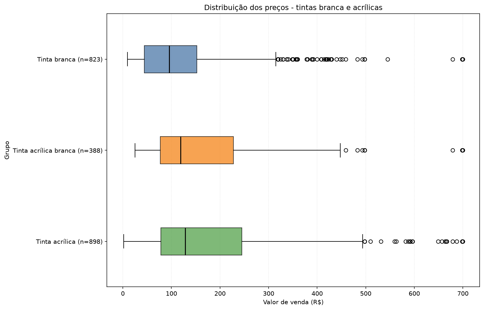
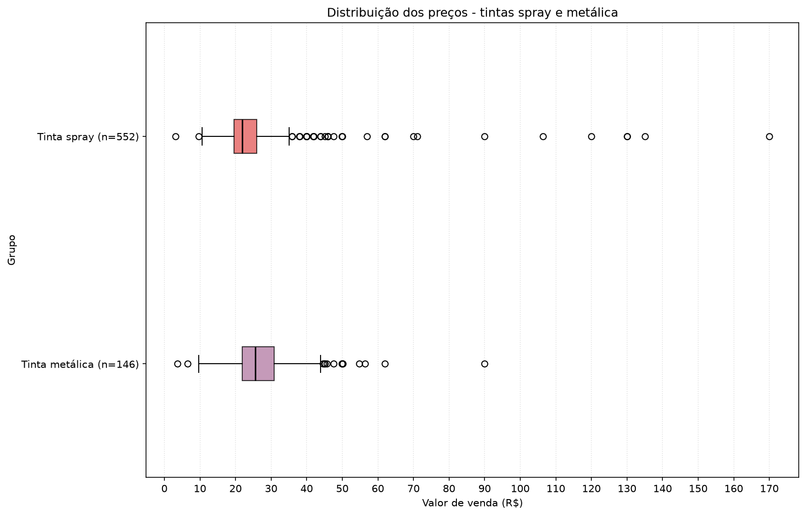
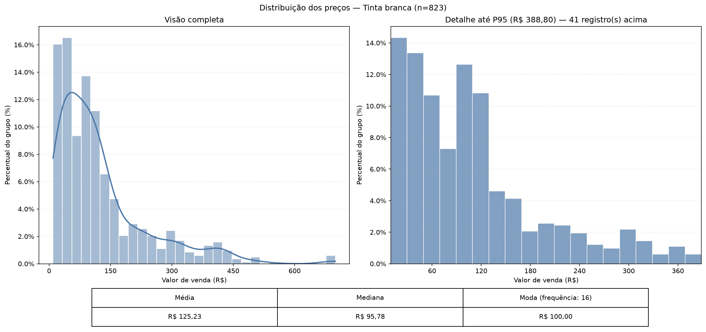
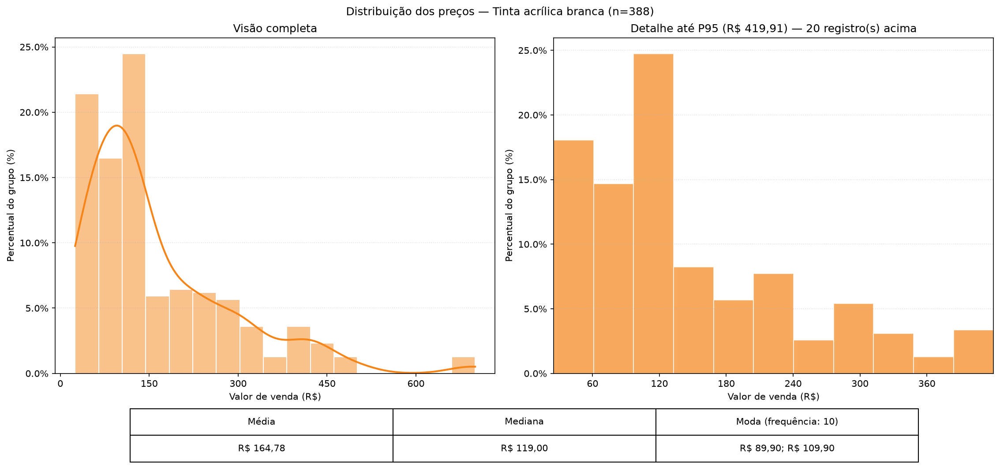
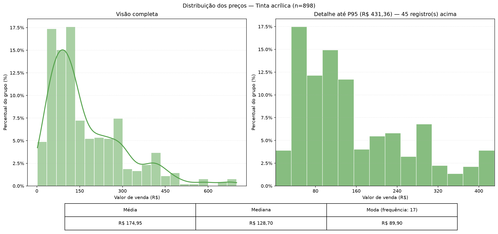
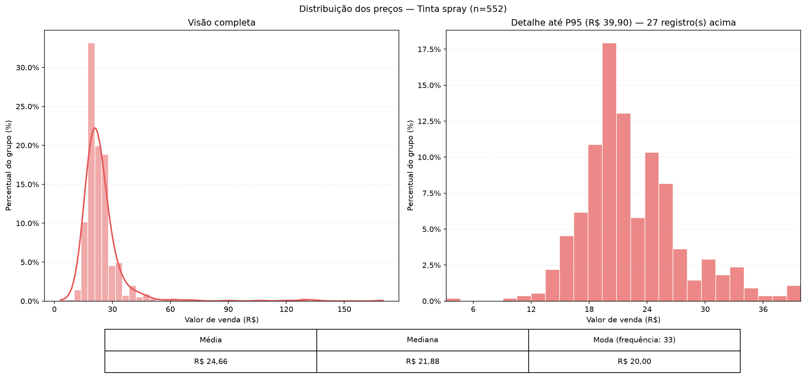
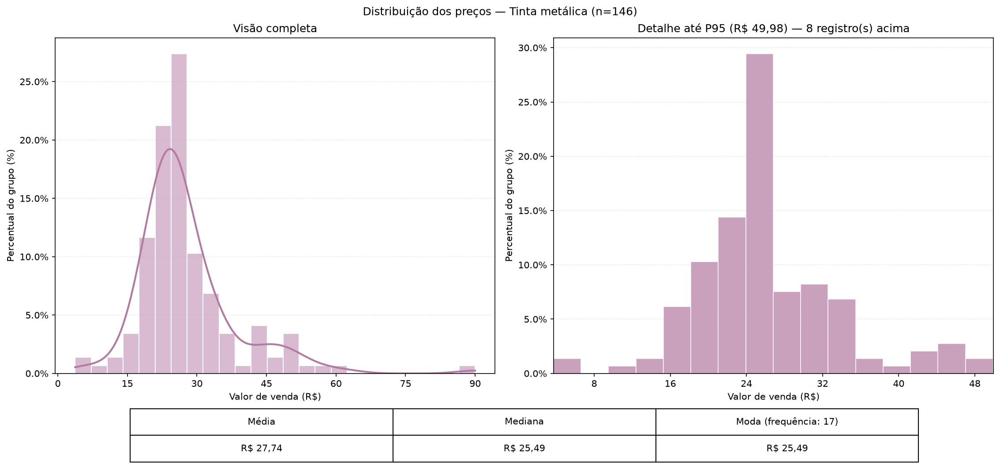

# Sobre

Projeto criado para atividade de Ciência de Dados, disciplina ministrada pelo professor Dr. Edison Camilo, no curso Bacharelado em Sistemas de Informação, no Instituto Federal de Alagoas.

Dupla:

* Eike Fabrício
* Luiz Vinícius

## Requisitos:

* Chave de API da Sefaz-AL
* UV (https://docs.astral.sh/uv/getting-started/installation/)

### Como executar: 

Criar arquivo `.env`, sendo cópia de `.env.example`, preenchendo o campo `SEFAZ_TOKEN`.

Instalar as bibliotecas e executar os comandos:

```bash
uv sync
uv run main.py
```

O pipeline cria a pasta `output` automaticamente na raiz do projeto. Por lá, teremos os arquivos:

* bronze.csv
    * Arquivo contém os dados brutos obtidos pela API.
    * Se já existir, será reutilizado. Para uma nova coleta, remova esse arquivo antes de executar o script.
* silver.csv
    * Arquivo contém as tintas classificadas nos grupos `tinta_branca`, `tinta_acrilica_branca`, `tinta_acrilica`, `tinta_spray` e `tinta_metalica`, independentemente da unidade de medida.
    * Um registro pode aparecer mais de uma vez quando corresponde a mais de um grupo. O grupo de cada linha é informado na coluna `grupo`.
* charts/
    * Pasta contendo os gráficos plotados:
        * Um boxplot comparando tintas brancas e acrílicas
        * Um boxplot comparando tintas spray e metálicas em uma escala própria
        * Um histograma de cada grupo com visão completa, detalhe até o percentil 95 e tabela de média, mediana e moda

## Resultado mostrado no terminal

Ao executar `uv run main.py`, o programa informa se usou o `bronze.csv` em cache ou coletou dados da API, o período das vendas, as quantidades em cada etapa, os motivos das exclusões, a contagem por grupo e os arquivos gerados. A mensagem de conclusão só aparece depois de salvar os gráficos.

**Retrato do cache atual:** vendas de 09/09/2026 a 15/09/2026. A coleta que criou este arquivo usava uma versão que deixava a última página da API de fora; portanto, os números abaixo podem não representar todas as vendas daquele período. A correção da paginação será aplicada quando o bronze for coletado novamente.

| Etapa | Registros |
|---|---:|
| Bronze | 2.600 |
| Excluídos por descrição (`tecido`, `coador`, `promocao`) | 30 |
| Sem correspondência com os cinco grupos | 749 |
| Registros classificados em pelo menos um grupo | 1.821 |
| Linhas no silver, contando grupos sobrepostos | 2.807 |

Antes de classificar, o ETL consolida descrições por `descricao_sefaz` e `codigo`, aplica maiúsculas, remove alguns sinais gráficos e padroniza unidades equivalentes (`UND`/`UNID` para `UN`; `LT`/`LITRO` para `L`).

As estatísticas usam `valor_venda` por registro de venda. Média e mediana são calculadas com os valores originais. Para a moda, os preços são agrupados em centavos; em caso de empate, todos os valores modais são exibidos. A frequência indica quantas vezes cada moda aparece.

| Conjunto | n | Média | Mediana | Moda | Frequência |
|---|---:|---:|---:|---:|---:|
| Bronze | 2.600 | R$ 107,15 | R$ 62,70 | R$ 20,00 | 37 |
| Tinta branca | 823 | R$ 125,23 | R$ 95,78 | R$ 100,00 | 16 |
| Tinta acrílica branca | 388 | R$ 164,78 | R$ 119,00 | R$ 89,90; R$ 109,90 | 10 |
| Tinta acrílica | 898 | R$ 174,95 | R$ 128,70 | R$ 89,90 | 17 |
| Tinta spray | 552 | R$ 24,66 | R$ 21,88 | R$ 20,00 | 33 |
| Tinta metálica | 146 | R$ 27,74 | R$ 25,49 | R$ 25,49 | 17 |

Os grupos se sobrepõem, então suas quantidades não devem ser somadas para contar vendas únicas. Os preços incluem unidades de medida e tamanhos de embalagem diferentes e não foram convertidos para preço por litro ou por unidade. Cada histograma mantém a distribuição completa e amplia a faixa até o percentil 95; o painel ampliado informa quantos registros ficaram acima desse limite, e ambos os painéis usam o total do grupo como base para os percentuais.

## Análise exploratória

### Boxplots por grupo

O primeiro boxplot compara as distribuições de preço das tintas branca,
acrílica branca e acrílica.



O segundo apresenta as tintas spray e metálica em uma escala adequada às suas
faixas de preço.



### Distribuições e outliers

Para a listagem abaixo, foram considerados outliers os registros cujo valor de
venda é estritamente superior ao limite visual definido para cada grupo. As
vendas repetidas do mesmo produto foram consolidadas. O levantamento completo
também está disponível em [OUTLIERS.md](OUTLIERS.md).

| Grupo | Limite | Produtos | Ocorrências |
|---|---:|---:|---:|
| Tinta branca | acima de R$ 515,00 | 4 | 6 |
| Tinta acrílica branca | acima de R$ 500,00 | 3 | 5 |
| Tinta acrílica | acima de R$ 500,00 | 15 | 22 |
| Tinta spray | acima de R$ 50,00 | 12 | 12 |
| Tinta metálica | acima de R$ 63,00 | 1 | 1 |

#### Tinta branca



| Código | Descrição | Ocorrências | Preço mínimo | Preço máximo |
|---|---|---:|---:|---:|
| 7891260559031 | TINTA ACR AC 18L BR NEVE TOQUE SEDA SUVINIL | 1 | R$ 699,90 | R$ 699,90 |
| 10786 | TINTA ACR PREMIUM TOQUE SEDA BRANCO ACETINADO 18L SUVINIL | 3 | R$ 698,40 | R$ 698,40 |
| 05977 | TINTA ACR PREMIUM DECORA SEDA BRANCO ACETINADO 18L CORAL | 1 | R$ 678,84 | R$ 678,84 |
| 3276007450118 | TINTA PRE EXT FOS BRANCA 18L LUXENS DE115936 POR108982 | 1 | R$ 544,91 | R$ 544,91 |

#### Tinta acrílica branca



| Código | Descrição | Ocorrências | Preço mínimo | Preço máximo |
|---|---|---:|---:|---:|
| 7891260559031 | TINTA ACR AC 18L BR NEVE TOQUE SEDA SUVINIL | 1 | R$ 699,90 | R$ 699,90 |
| 10786 | TINTA ACR PREMIUM TOQUE SEDA BRANCO ACETINADO 18L SUVINIL | 3 | R$ 698,40 | R$ 698,40 |
| 05977 | TINTA ACR PREMIUM DECORA SEDA BRANCO ACETINADO 18L CORAL | 1 | R$ 678,84 | R$ 678,84 |

#### Tinta acrílica



| Código | Descrição | Ocorrências | Preço mínimo | Preço máximo |
|---|---|---:|---:|---:|
| 7891260559031 | TINTA ACR AC 18L BR NEVE TOQUE SEDA SUVINIL | 1 | R$ 699,90 | R$ 699,90 |
| 10786 | TINTA ACR PREMIUM TOQUE SEDA BRANCO ACETINADO 18L SUVINIL | 3 | R$ 698,40 | R$ 698,40 |
| 10700 | TINTA ACR PREMIUM TOQUE FOSCO COMPLETO CROMIO FOSCO 18L SUVINIL | 1 | R$ 687,13 | R$ 687,13 |
| 05977 | TINTA ACR PREMIUM DECORA SEDA BRANCO ACETINADO 18L CORAL | 1 | R$ 678,84 | R$ 678,84 |
| 7891019993819 | TINTA ACR FOSC PROF BASE T 16L MASTER CORAL | 1 | R$ 666,84 | R$ 666,84 |
| 7892948051786 | TINTA ACR EMBORRACHADA BASE P 16L FACHADA IQUINE | 2 | R$ 596,40 | R$ 665,57 |
| 7891260559062 | TINTA ACR AC 16L BASE A2 TOQUE SEDA SUVINIL | 1 | R$ 663,39 | R$ 663,39 |
| 7892948044177 | TINTA ACR SB LIMPA FACIL BASE C 16L IQUINE | 3 | R$ 595,77 | R$ 656,72 |
| 7891260561805 | TINTA ACR FOS 16L BASE A2 TOQUE FOSCO SUVINIL | 2 | R$ 591,90 | R$ 591,90 |
| 896867 | TINTA ACR SB 16L BASE PM BRILHO E PROTECAO CORAL | 1 | R$ 590,99 | R$ 590,99 |
| 7891019993826 | TINTA ACR FOSC PROF BASE MF 16L MASTER CORAL | 1 | R$ 587,23 | R$ 587,23 |
| 7891260059067 | TINTA ACR STANDARD BRILHO PRATICO MARFIM SEMI BRILHO 18L GLASU | 1 | R$ 581,90 | R$ 581,90 |
| 7891019993840 | TINTA ACR FOSC PROF BASE P 16L MASTER CORAL | 2 | R$ 531,40 | R$ 562,87 |
| 7891019906840 | TINTA ACR FOSC BASE T 16L DECORA CORAL | 1 | R$ 559,24 | R$ 559,24 |
| 7891019920235 | TINTA ACRAL PREM INT ALGODAO EGAPCIO 18L DE54245 POR50995 | 1 | R$ 509,95 | R$ 509,95 |

#### Tinta spray



| Código | Descrição | Ocorrências | Preço mínimo | Preço máximo |
|---|---|---:|---:|---:|
| 5057 | TINTA SPR ALTA T 350ML/250G PRETO FOSCO CX/6 QTD. 1.00 CX | 1 | R$ 170,00 | R$ 170,00 |
| 1040 | TINTA SPRAY 400ML PRETO FOSCO - CHEMICOLOR | 1 | R$ 135,00 | R$ 135,00 |
| 113 | TINTA SPR GER PRETO FOSCO 350ML CX/6 QTD. 1.00 CX | 1 | R$ 130,00 | R$ 130,00 |
| 2682 | SPRAY TINTAS LUX U GERAL BR BRILH 400ML | 1 | R$ 130,00 | R$ 130,00 |
| 5408 | TINTA SPRAY NORDESTIN PTO BRILHANTE 350ML | 1 | R$ 120,00 | R$ 120,00 |
| 498 | TINTA SPRAY USO G 350ML BR TEK BOND | 1 | R$ 106,35 | R$ 106,35 |
| 234 | TINTA SPRAY ALTA TEMP. 350ML ALUMINIO - CHEMICOLOR | 1 | R$ 90,00 | R$ 90,00 |
| 10815 | SPRAY CGIN PLASTICO BRANCO FOSCO (1520) 350ML COLORGIN | 1 | R$ 71,10 | R$ 71,10 |
| 10814 | SPRAY CGIN PLASTICO PRETO FOSCO (1511) 350ML COLORGIN | 1 | R$ 70,00 | R$ 70,00 |
| 7891494000514 | TINTA SPRAY CROMADO 350ML INT METALLIK COLORGIN | 1 | R$ 61,90 | R$ 61,90 |
| 7891494008527 | TINTA SPRAY BR 350ML EPOXY COLORGIN | 1 | R$ 61,90 | R$ 61,90 |
| 2007142 | TINTA SPRAY TEK BOND- PRETO BRILHANTE 350 ML- ALTA TEMP. | 1 | R$ 56,90 | R$ 56,90 |

#### Tinta metálica



| Código | Descrição | Ocorrências | Preço mínimo | Preço máximo |
|---|---|---:|---:|---:|
| 234 | TINTA SPRAY ALTA TEMP. 350ML ALUMINIO - CHEMICOLOR | 1 | R$ 90,00 | R$ 90,00 |
